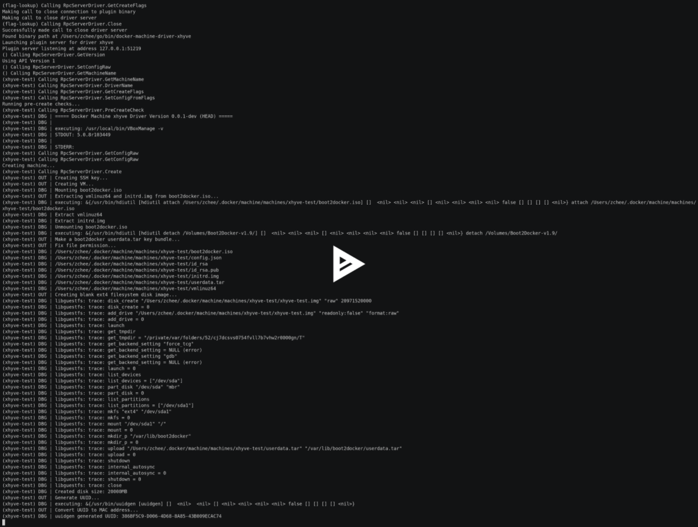

# docker-machine-driver-xhyve

Docker Machine driver plugin for [xhyve](https://github.com/mist64/xhyve) native OS X Hypervisor

Master branch inherited from [nathanleclaire/docker-machine-driver-xhyve](https://github.com/nathanleclaire/docker-machine-driver-xhyve). Thanks [@nathanleclaire](https://github.com/nathanleclaire) :)  
If you have issues or pull-requests, Desired to be posted to this repository.


## Screencast
[](https://asciinema.org/a/29930)


## Required

### docker-machine
https://github.com/docker/machine

docker-machine-driver-xhyve using docker-machine plugin model.

**Please do not post the issue of this repository to the docker/machine**  
It will interfere with the development of the docker-machine.  
If you were doubt problem either, please post to this repository [issues](https://github.com/zchee/docker-machine-driver-xhyve/issues).

```bash
> go get github.com/docker/machine
> cd $GOPATH/src/github.com/docker/machine
# Build docker-machine and some docker-machine official(embedded) driver binary
> make build
# Install all binary into /usr/local/bin/
> make install
```

### xhyve-bindings
https://github.com/zchee/xhyve-bindings

Separated xhyve Go bindings into [xhyve-bindings](https://github.com/zchee/xhyve-bindings).  
Or, see experimental embedded xhyve branch [embed-xhyve](https://github.com/zchee/docker-machine-driver-xhyve/tree/embed-xhyve)

```bash
> go get -d github.com/zchee/xhyve-bindings
> cd $GOPATH/src/github.com/zchee/xhyve-bindings
> make
> make install
```

## Install

Like the docker-machine's `Makefile`, install the `docker-machine-driver-xhyve` binary will be in `/usr/local/bin`.  

```bash
> go get -d github.com/zchee/docker-machine-driver-xhyve
> cd $GOPATH/src/github.com/zchee/docker-machine-driver-xhyve
> make
> make install
```

## Usage

### Available flags

| Flag name                        | Environment variable            | Type   | Description                              | Default                                                  |
|----------------------------------|--------------------------------|--------|------------------------------------------|----------------------------------------------------------|
| `--xhyve-boot2docker-url`        | `XHYVE_BOOT2DOCKER_URL`        | string | The URL(Path) of the boot2docker image   | `$HOME/.docker/machine/cache/boot2docker.iso`            |
| `--xhyve-cpu-count`              | `XHYVE_CPU_COUNT`              | int    | Number of CPUs to use the create the VM  | `1`                                                      |
| `--xhyve-memory`                 | `XHYVE_MEMORY_SIZE`            | int    | Size of memory for the guest             | `1024`                                                   |
| `--xhyve-disk-size`              | `XHYVE_DISK_SIZE`              | int    | Size of disk for the guest (MB)          | `20000`                                                  |
| `--xhyve-boot-cmd`               | `XHYVE_BOOT_CMD`               | string | Booting xhyve iPXE commands              | See [boot2docker/boot2docker/doc/AUTOMATED_SCRIPT.md][1] |
| `--xhyve-experimental-nfs-share` | `XHYVE_EXPERIMENTAL_NFS_SHARE` | bool   | Enable `NFS` folder share (experimental) | `false`                                                  |

## Would you do me a favor?
I'm very anxious whether other users(except me) are able to launch the xhyve.  
So, if you were able to launch the xhyve use docker-machine-driver-xhyve, Would you post a report to this issue thread?
https://github.com/zchee/docker-machine-driver-xhyve/issues/18

At present, I do not have a way to automatically test.  
`Travis CI` provide only the OS X 10.9 Marvericks. Not support `Hypervisor.framework` and `vmnet.framework`.  
`Circle CI` does not provide OS X. Also iOS build is currently beta.

And, if OS X launched by the `Vagrant`, can be build, but will not be able to launch the Hypervisor.  
The cause probably because backend vm (Virtualbox, VMWare, parallels...) to hide the CPU infomation.

In the case of VMWare,
```bash
$ system_profiler SPHardwareDataType
2015-11-21 10:04:18.972 system_profiler[458:1817] platformPluginDictionary: Can't get X86PlatformPlugin, return value 0
2015-11-21 10:04:18.974 system_profiler[458:1817] platformPluginDictionary: Can't get X86PlatformPlugin, return value 0
Hardware:

    Hardware Overview:

      Model Name: Mac
      Model Identifier: VMware7,1
      // Where is "Processor Name:" field?
      Processor Speed: 2.19 GHz
      Number of Processors: 1
      Total Number of Cores: 1
      L2 Cache: 256 KB
      L3 Cache: 6 MB
      Memory: 2 GB
      Boot ROM Version: VMW71.00V.0.B64.1505060256
      SMC Version (system): 1.16f8
      Serial Number (system): ************
      Hardware UUID: ********-****-****-****-************

> git clone https://github.com/mist64/xhyve && cd xhyve
> make
> ./xhyverun.sh
vmx_init: processor not supported by Hypervisor.framework
Unable to create VM (-85377018)
```


## Known isuue

### Not implement shared folder
`docker-machine-driver-xhyve` also `xhyve` does not implement shared folder system.  
Please use the existing protocol for the time being, such as `NFS`.

`docker-machine-driver-xhyve` can create a `NFS` share automatically for you, but this feature
is highly experimental. To use it specify `--xhyve-experimental-nfs-share` when creating your
machine.

### Get state use `ssh`, do not know real vm state
`docker-machine-driver-xhyve` checking vm state use send `exit 0` on `ssh`.  
but, that is not real state of vm.  

`xhyve` has the XPC dictionary on backend. (still uncertain)  
XPC Services is part of libSystem, provides a lightweight mechanism for basic interprocess communication integrated with Grand Central Dispatch and launchd.  
In the future, get the state to use it.

### Does not clean up the vmnet when remove a VM
Current state, `docker-machine-driver-xhyve` does not clean up the vmnet configuration.  

```
Running xhyve vm (e.g. IP: 192.168.64.1)
        |
`docker-machine rm`, ACPI signal(poweroff) in over ssh
        |
vm is poweroff, `goxhyve` also killed with to poweroff
        |
Re-create xhyve vm.
```
New vm's ip, It will probably be assigned to 192.168.64.**2**. If create another new vm, assigned to 192.168.64.**3**  
but 192.168.64.**1** are not using anyone.

`vmnet.framework` seems to have decided to IP based on `/var/db/dhcpd_leases` and `/Library/Preferences/SystemConfiguration/com.apple.vmnet.plist`  
So, To remove it manually, or Don’t even bother.  
Maybe `vmnet.framework` shared net address range `192.168.64.1` ~ `192.168.64.255`. You can make 255 vm.

I will fix after I understand the `vmnet.framework`

### Total Memory can not be set more than 3GB
This seems to be a bug from bhyve.  
I tested CoreOS and TinyCoreLinux by original `xhyve`,  but also could not be set more than 3GB.  


[1]: https://github.com/boot2docker/boot2docker/blob/master/doc/AUTOMATED_SCRIPT.md#extracting-boot-parameters
